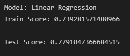
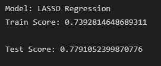
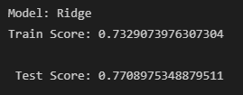
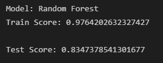
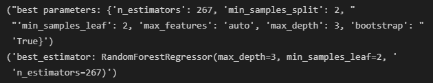
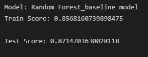

# [Medical Insurance Cost Estimator](https://medical-insurance-costs.herokuapp.com)

### Team Members: Karina Hutula, Ling Lv, Kyle Shimberg, Ranjani Anjur Venkatraman, Dawn Washington

## Table of Contents
1. [The Idea](#idea)
2. [Source](#source)
3. [Dataset](#data)
4. [Technologies](#tech)
5. [Extract, Transform, and Load](#etl)
6. [Exploratory Data Analysis](#eda)
7. [Regression Modeling](#regression)
8. [Model Deployment](#model)
9. [The Website](#site)
10. [Estimator Landing Page](#home)
11. [EDA](#eda-page)
12. [Next Steps](#future)

### The Idea
Our mission is to provide a nationally recognized site used by companies to predict medical costs for potential employees. 

With an average annual cost of heathcare per American at $11,000 and expected annual cost growth of over 5%, medical costs are one of the largest expenses that employers face.  We believe our product can help an employer understand what influences their costs.

### Source
We collected our data from [Medical Cost Personal Dataset](https://www.kaggle.com/mirichoi0218/insurance) from Kaggle.  The data itself is provided by a book that introduces machine learning using R, but the dataset is made publically available on Kaggle.

### Dataset
Our data contains just under 1400 rows of data, which is really just a sample from a larger population. There are seven columns including: age, sex, bmi, children, smoker, region, and charges. Age and children are integer variables. Sex, smoker, and region are categorical variables. BMI and charges are float number variables. The charges column is what we will be trying to predict with our model.

Limitations of our dataset include:
* smaller size (sample size rather than full population)
* not recently collected and maintained (2014)
* costs are rising year over year, so the data and model would both need to be kept in check every year

### Technologies
* Javascript: D3, Plotly
* Visualizations: Tableau
* Framework: Jinja, Flask
* Deployment: Heroku
* Additional: CSS, HTML, Python, Pandas, SKLearn, Bootstrap, SQLite, Jupyter Notebook, Pickle, Joblib

### Extract, Transform, and Load
The data was provided to us in a CSV. We checked for any null values in the dataset, and did not have any. We also checked to verify that datatypes matched the variables values as described above. Our data checked out in all these areas, so no additional transformation was required. Then, we created an [SQLite database](static/Resources/gtbc_project_4.db) for our data to be stored in. We did this using our knowledge of [SQLite and Pandas](static/Resources/save_project4_data_into_sqlite_db.ipynb).

### Exploratory Data Analysis
Now that the data has been verified as clean, we begin our data exploration in our [main notebook](static/Resources/Medical_Insurance.ipynb). We also used [Tableau](static/images/Medical_Costs.twbx) to do some visualizations. We visualized many different aspects of our data, but some of the main points are mentioned below.

In this distribution plot, we can see that our data is highly concentrated on charges under $10,000, but charges range as high as $65,000.

Looking at a correlation matrix of all the variables, it is evident that the strongest correlation of charges is smoker.  The next strongest correlation is age, and the third strongest is BMI. The rest of the variables have a very weak correlation to charges. It is important to note that smoker is a categorical (yes/no) variable, so while the correlation holds some meaning, it is not meant to be the final say. We used this chart as a means to get to know our data better, not as a means to choose variables for modeling.

Charges in the Northeast and Northwest average around the lower end at under $10,000 for non-smokers and $30,000 for smokers. The Southwest falls in the middle with roughly similar costs for non-smokers, but for smokers, costs come out around $32,000. The Southeast's averages for non-smokers is similar again, but with smokers costs at $35,000! Overall, the differences between regions are very small and can probably be explained by other variables, while the differences between smoker and non-smoker are very clear.

Overall differences of charges between age groups is evident, but not extreme. For the purposes here, young adult ranges from 17 to 35 and senior adult ranges to 55 followed by elder for all other ages.

### Regression Modeling

During the [regression modeling phase](static/Resources/Medical_Insurance.ipynb), we tested four different models to find the best output.  Before testing the models, we standardized our data using StandardScaler. For the categorical variables, we utilized One Hot Encoding to make the variables friendly for modeling.

We initially tried Linear Regression, where we got a test score of about 78%.

Next we tried LASSO Regression, which is very similar to Linear Regression in that it minimizes the sum of the squared errors; however, LASSO Regression also adds a penalty factor. The penalty factor is the sum of the absolute values of the coefficients. In LASSO Regression, the coefficients of features that don't contribute predictive power can go to zero. Our test score is extremely close to that of Lienar Regression.

Then we tried Ridge Regression, which is similar to LASSO Regression with the penalty factors; however, the Ridge penalty factor is the sum of the squared values of the coefficients.  In Ridge Regression, the coefficients can't go to zero, but this type of regression also doesn't get as confused by collinear features. Also, the coefficients are more stable. Our test score is again very similar to the previous two test scores.

Finally, we tried Random Forest, where our initial model got a test score of 83.5%. 

This is an improvement on the previous models, but we think we can do better. After taking a look at the feature importances for this model, we have decided that children, sex, and region are all providing negligibly helpful results.

After deciding to remove these variable from the model, we also performed hyperparameter tuning using search_grid to help improve the model. With our optimized hyperparameters, we are able to get our test score up to 87.1%. We are much happier with this output.

### Model Deployment

Now that we have our machine learning model selected, we need to deploy the model for use on our website. Within our [notebook](static/Resources/Medical_Insurance.ipynb), we used pickle and joblib to save our model in a usable and callable file. 

## [The Website](https://medical-insurance-costs.herokuapp.com)

### [Estimator Landing Page](https://medical-insurance-costs.herokuapp.com)

Our landing page is the main attraction. This is where a user will go to input their variables for Age, Height, Weight, and Smoker. It is important to note that BMI is the input to our model, but in order to make the site more user friendly, we opted to allow the user to input Weight and Height instead. Once the calculate button is pressed, the BMI is automatically calculated and inputted into the model. Once calculations are complete, a cost value displays as well as a plotly chart that shows where the user falls on the density chart from our dataset.

### [EDA Page](https://medical-insurance-costs.herokuapp.com/eda)

This page was added as a fun extra for those who are data-curious to see some behind the scenes information on our data. We provided some of our EDA charts and images and explanations.

### Next Steps

We have a couple of ideas for the future state of our product. Firstly, we'd like to add information on our regression modeling and more to our website. We would also like to have the ability to link the site with widely-used human resources tools. Finally, it would be great for both our dataset and model accuracy if we allowed companies to upload their data to the site.