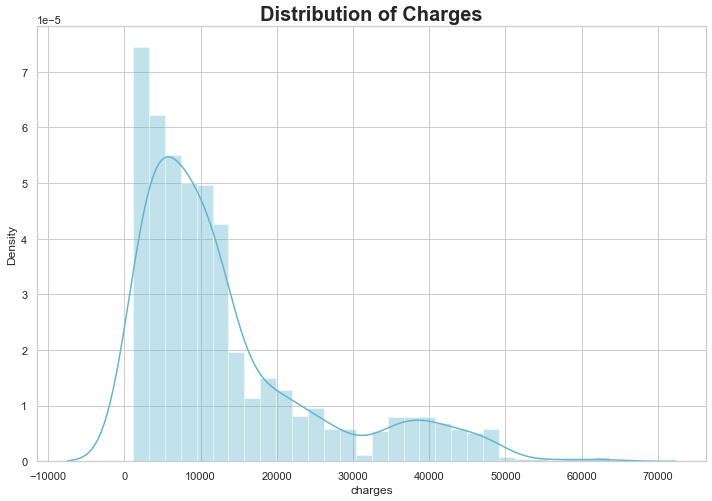
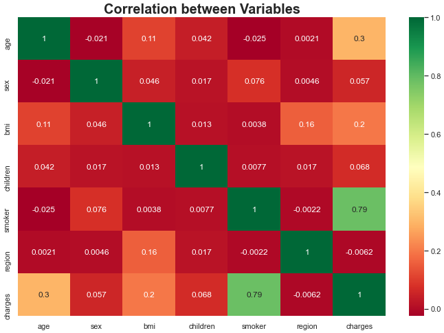
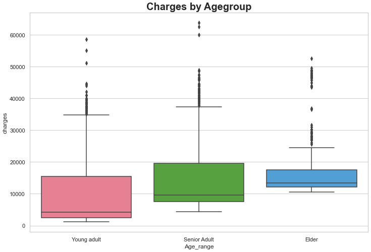

# [Medical Insurance Cost Estimator](https://medical-insurance-costs.herokuapp.com)

### Team Members: Karina Hutula, Ling Lv, Kyle Shimberg, Ranjani Anjur Venkatraman, Dawn Washington

## Table of Contents
1. [The Idea](#idea)
2. [Source](#source)
3. [Dataset](#data)
4. [Technologies](#tech)
5. [Extract, Transform, and Load](#etl)
6. [Exploratory Data Analysis](#eda)
7. [Regression Modeling](#regression)
8. [Model Deployment](#model)
9. [The Website](#site)
10. [Estimator Landing Page](#home)
11. [EDA](#eda-page)
12. [Next Steps](#future)

### The Idea
Our mission is to provide a nationally recognized site used by companies to predict medical costs for potential employees. 

With an average annual cost of heathcare per American at $11,000 and expected annual cost growth of over 5%, medical costs are one of the largest expenses that employers face.  We believe our product can help an employer understand what influences their costs.

### Source
We collected our data from [Medical Cost Personal Dataset](https://www.kaggle.com/mirichoi0218/insurance) from Kaggle.  The data itself is provided by a book that introduces machine learning using R, but the dataset is made publically available on Kaggle.

### Dataset
Our data contains just under 1400 rows of data, which is really just a sample from a larger population. There are seven columns including: age, sex, bmi, children, smoker, region, and charges. Age and children are integer variables. Sex, smoker, and region are categorical variables. BMI and charges are float number variables. The charges column is what we will be trying to predict with our model.

### Technologies
* Javascript: D3, Plotly
* Visualizations: Tableau
* Framework: Jinja, Flask
* Deployment: Heroku
* Additional: CSS, HTML, Python, Pandas, SKLearn, Bootstrap, SQLite, Jupyter Notebook, Picklet, Joblib

### Extract, Transform, and Load
The data was provided to us in a CSV. We checked for any null values in the dataset, and did not have any. We also checked to verify that datatypes matched the variables values as described above. Our data checked out in all these areas, so no additional transformation was required. Then, we created an [SQLite database](static/Resources/gtbc_project_4.db) for our data to be stored in. We did this using our knowledge of [SQLite and Pandas](static/Resources/save_project4_data_into_sqlite_db.ipynb).

### Exploratory Data Analysis
Now that the data has been verified as clean, we begin our data exploration in our [main notebook](static/Resources/Medical_Insurance.ipynb). We also used [Tableau](static/images/Medical_Costs.twbx) to do some visualizations. We visualized many different aspects of our data, but some of the main points are mentioned below.

In this distribution plot, we can see that our data is highly concentrated on charges under $10,000, but charges range as high as $65,000.

Looking at a correlation matrix of all the variables, it is evident that the strongest correlation of charges is smoker.  The next strongest correlation is age, and the third strongest is BMI. The rest of the variables have a very weak correlation to charges. It is important to note that smoker is a categorical (yes/no) variable, so while the correlation holds some meaning, it is not meant to be the final say. We used this chart as a means to get to know our data better, not as a means to choose variables for modeling.

Charges in the Northeast and Northwest average around the lower end at under $10,000 for non-smokers and $30,000 for smokers. The Southwest falls in the middle with roughly similar costs for non-smokers, but for smokers, costs come out around $32,000. The Southeast's averages for non-smokers is similar again, but with smokers costs at $35,000! Overall, the differences between regions are very small and can probably be explained by other variables, while the differences between smoker and non-smoker are very clear.

Overall differences of charges between age groups is evident, but not extreme. For the purposes here, young adult ranges from 17 to 35 and senior adult ranges to 55 followed by elder for all other ages.

### Regression Modeling

### Model Deployment

## [The Website](https://medical-insurance-costs.herokuapp.com)

### [Estimator Landing Page](https://medical-insurance-costs.herokuapp.com)

### [EDA Page](https://medical-insurance-costs.herokuapp.com/eda)

### Next Steps
